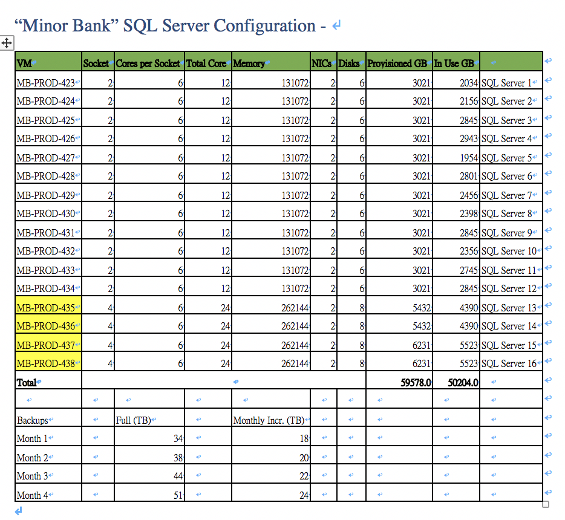

.. Adding labels to the beginning of your lab is helpful for linking to the lab from other pages
.. _designlab1:

------------------------------
SQL Database Group Discuss Lab
------------------------------

1. Introduction
++++++++++++

**Basic Situation & Requirements -**

-	Customer “Master Bank “ they recently merge a small bank called “Minor Bank”. In the “Minor Bank” they have 16 x SQL physical servers in production data center.

-	“Master Bank “ is already a high virtualization in their data center. They want “Minor Bank” doing the virtualization first then merge to their current data center.

-	“Minor Bank” provide their current SQL servers’ configuration ,  there are 14 servers are standalone , and 2x 2 nodes SQL servers are SQL FCI (Fail Cluster Instances) clusters environment , all the current configuration is in Appendix .

-	“Minor Bank” who’s physical servers are same model  “HP ProLiant DL380 G7” , and use Intel CPU “Intel Xeon Processor X5680”, Standalone is 2 sockets and SQL FCI servers are 4 sockets.

-	For standalone SQL Servers CPU usage are 50% peak, 30% steady state , those SQL FCI  Servers CPU usage are 75% peak, 50% steady state

-	They think about the SQL server version is too old (Current is SQL server version 2008R2) , so they will upgrade to SQL server version  2014 or SQL server version 2016

-	All the SQL Servers storage is HP 3PAR. Their original SAN configuration are complicated. Every servers have two HBA cards and HP 3PAR have 8 front-end FC ports for connect. They want make storage configuration simple and easy to manage

-	They also provide the storage current usage and backup usage in the Appendix A

**HA Requirement –**

- “Minor Bank” current local protect using storage vender’s solutions. The solution will create snapshot every 3 hours and keep for one week snapshot for restore.  They prepared a physical restore server to make sure the data is correct and then restore to the original servers. But after merge by “Master Bank” , the “Master Bank” have higher SLA requirement .

- “Master Bank “ their SLA for SQL server database : Standalone SQL servers require 1hrs RTO and RPO minimum . For those FCI SQL Servers , their requirement are RTO within 10 minutes, and RPO is 0.

1.1 Requirements
++++++++++++

- All this four SQL database will need DR solutions , SQL Servers standalone their RPO/RTO are 1 hours. But those SQL FCI Servers (Tier one SQL Server), their RTO is same requirement with HA . RTO is within 10 minutes and RPO is 0.

- The Bandwidth is not limitation for “Master Bank” , who have a dedicate and enough bandwidth network between two datacenter within 5 ms round-trip latency.

1.2 Migration  Requirements
+++++++++++++++++++++++

-	Customer want a minimum downtime as possible , and Nutanix need provide how and what’s the downtime for customer ?

-	A Comprehensive roll-back plan if migration failed

2. Requirements
+++++++++++++++

- Size both for Production and DR  site provide a deployment architecture

- Hybrid or All Flash node can be considerate

- Provide the design that met customer RTO/RPO requirement

- Need to save user license and also hardware cost as possible

- DR solution design , you can use Nutanix or Application Level to achieve  customer requirement

3. Tools for sizing
+++++++++++++++++++

- CPU Benchmark https://www.spec.org/cpu2006/

- SAP SD Standard Performance Tests http://www.sap.com/solution/benchmark/measuring.html

- Nutanix Sizer https://services.nutanix.com/#/

- Mindtickle SQL Server Training
 

Appendix (Server information)
++++++++

**Microsoft SQL Server informations **

Lab Time
++++++++
Group discussion (30 minutes)
Review Desing (15 minutes)
