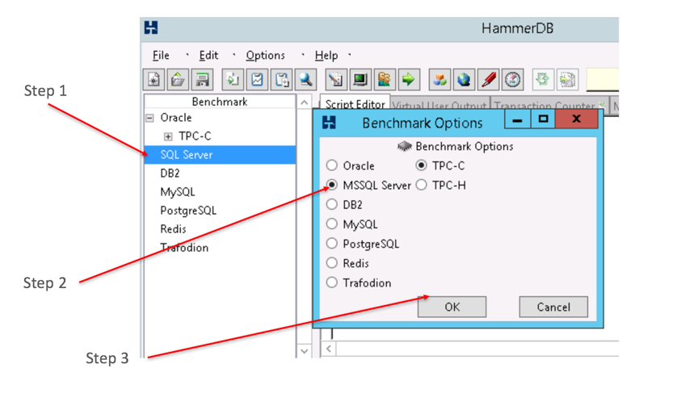
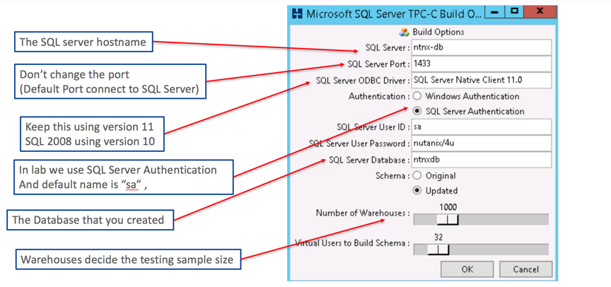
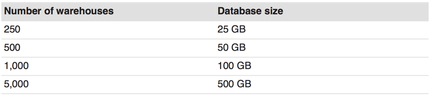
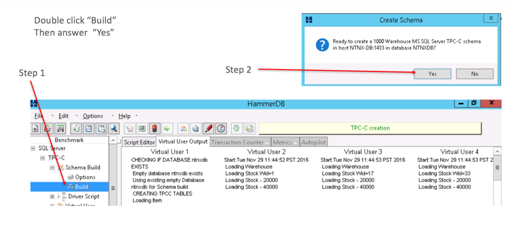
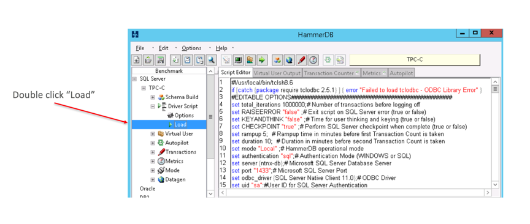
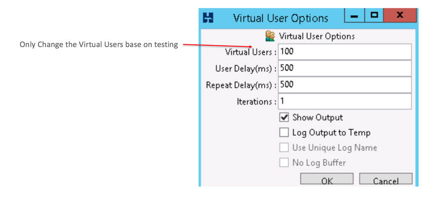
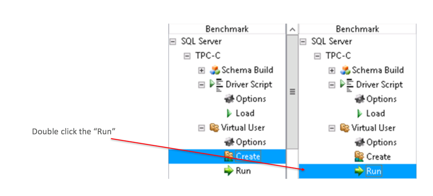
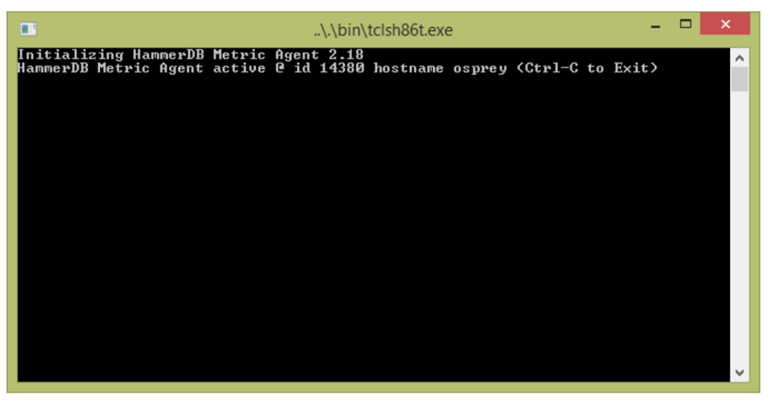
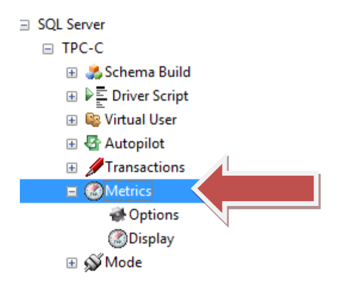
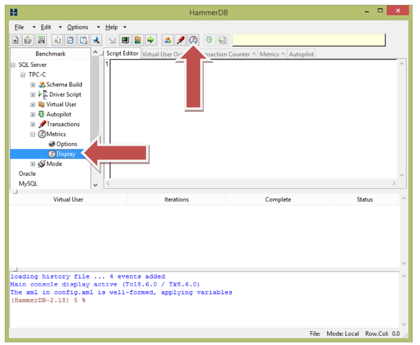

.. Adding labels to the beginning of your lab is helpful for linking to the lab from other pages
.. _example_lab_1:

----------------------
Lab 1: Running HammerDB
----------------------

1.1 Download the HammerDB
+++++++++++++++++++++++++

HammerDB is an open source database load testing and benchmarking tool for Oracle Database,
Microsoft SQL Server, IBM DB2, TimesTen, MySQL, MariaDB,  PostgreSQL,Postgres Plus Advanced Server,
Greenplum, Redis, Amazon Aurora and Redshift and Trafodion SQL on Hadoop. You can download from here.

http://www.hammerdb.com/download.html

It provide the Windows version as well as Linux version.
You can also download the documents from this link.

http://www.hammerdb.com/hammerdb_quickstart_mssql.pdf

1.2 Install HammerDB
++++++++++++++++++++

Install HammerDB is very easy , download the package from the website , and follow the Windows installation.
Next-> Next or you can reference the installation guide that provide by

http://www.hammerdb.com/hammerdb_install_guide.pdf

1.3 Start the TPCC testing
++++++++++++++++++++++++++

Once the HammerDB application is open, in the Benchmark pane, select TPC-C

http://www.tpc.org/tpcc/

TPC Benchmark C is an on-line transaction processing (OLTP) benchmark.
In the Benchmark Options box, select MSSQL Server and TPC-C and then click OK

1.4 Build testing schema
++++++++++++++++++++++++

First all, you need build a schema for the whole testing . Some of the vender will create a small schema like 1GB or maybe less than 100 MB . This is not a correct testing . When they create such small database schema . The data always on the database buffer , so the performance look so great . Suggest should be same size of customer current database or great than database’s buffer size .
Steps-  Below TPC-C, click Schema Build and then double-click Options.
In the window that appears, enter your SQL Server host name, or IP address, database username, and password.
After you fill up all the parameter , then click “OK”

1.5 Size of warehouse
+++++++++++++++++++++

When you choose the warehouse , that means the size of the schema. Please check the table below –

In current version , the maximum size of the schema is 500GB . Remember 100 about 10GB schema size .
After everything setup completed in the option , then go schema build – Follow the diagram shows.
If your VM have multiple vCPU, you can choose multiple virtual users help to accelerate the build process.

1.6 Create the driver script
++++++++++++++++++++++++++++

Driver create is to generate the script for testing and setup “how long we need to test and rampup time” .  Here are steps -

1.In the Benchmark pane, expand the Driver Script section and double-click Options

2.Configure the SQL Server hostname, IP, login, password, and database name to match the environment. In this case, use the same settings used when creating the database.

3.Select the Timed Test Driver script and select the Checkpoint when complete.

4.To ensure a realistic workload, use five Minutes of Rampup Time and 10 Minutes for Test Duration.

5.Once all settings are configured, click OK to exit the menu

.. figure:: images/sql05.png

Note - If you need to run a test with SQL 2008, use SQL Server Native Client 10.0.

6.Next, double-click Load in the Driver Script section of the Benchmark pane to activate the driver script (see the figure below)

7.Load the driver Script

1.7 Configure the virtual users
+++++++++++++++++++++++++++++++

Configure how many users you need to run concurrent in the system. In my example,
I show 100 users running concurrently. But you can try different users and see if the TPM is go up?
When you add more users then you saw the TPM is not coming up . That means you have some bottleneck in CPU, Memory or IO. You need to figure out why ? Using our Prism and Window performance monitor tools to diagnostic the bottleneck
Steps –

1.Expand the Virtual Users section and double click Options.

2.The number of virtual users depends on the configuration used to create the database.
TPC- C recommends using a 10x ratio to prevent row locking. Accordingly, if you defined your warehouse count (scale) as 1,000,
then set the Virtual Users to 100.

3.For the TPC-C driver script, HammerDB recommends leaving the Iterations, User Delays,
and Repeat Delays at the “default settings” and to modify only the Total Transactions per User,
or total iterations value, inside the Driver Script.

4.Select the Show Output checkbox to enable error messages in the console.

5.Click OK.

6.Click run

1.8 Metrics provide by HammerDB
+++++++++++++++++++++++++++++++

After you installed the hammnerDB , you can find in your folder have three files cslled “hdbagent.bat”, “hdbagent.tcl”, “ mpstat”.
These files are for monitoring the CPU resources in the testing VM .

Running the Agent – please execute the agent in your testing VM .
Windows just need to double click the .bat file. In the Linux system, you need to execute the .tcl file .
After you run the agent , you will see a screen like below .

Remember this @ id “xxxxx”. Our example is 14380 . remember this number .
Go back to hammerDB main screen , choose the Metrics

Double click the Options , then it will show the “Connect to Agent Options” , just give the id and hostname (The ID is what we get in previous screen 14380) . Click on the Display button or treeview to connect to the agent.

