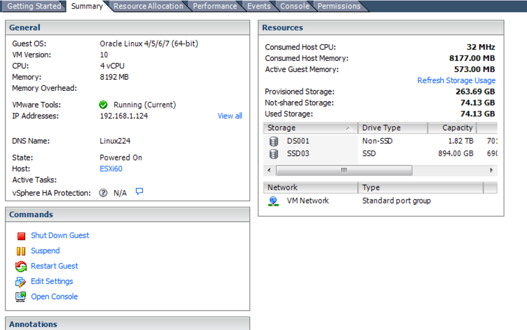

.. Adding labels to the beginning of your lab is helpful for linking to the lab from other pages
.. _sqllab02:

----------------------------------------
Lab 2: Apply Microsoft SQL best practice
----------------------------------------

2.1 Apply the SQL best practice
+++++++++++++++++++++++++++++++

When you go customer site for POC , please make sure everything already follow our SQL best practice guide.
You can find in Nutanix Website and download it. Please download two versions ,
one is SQL server 2008R2 ,2012, 2014 on Nutanix , and the other one is SQL server 2016 on Nutanix.
There are some little difference. Some of the parameter you don’t need to apply in the SQL server 2016.

2.2 Disk layout
+++++++++++++++

The most important thing in the SQL server is design the I/O. Some of the customers who move physical servers to virtual server ,
they forget to design I/O. Consequence is lose the performance.
In Nutanix, you can use any hypervisor. For the ESXi and AHV as a example .
ESXi you need to separate disks into different pv-scsi initiators.
AHV we use the virtio, it can support more queue in a single virtual scsi. So you just need one scsi to have all of the vdisks.

Here is a layout of SQL design for the ESXi , but for the AHV , the Controller will be only one controller.

In this lab , we will use AHV as our lab. ESXi just for your reference .

we need create 100GB x2 locate in PVSCSI 1, 2 , 80 GBx 2 locate in PVSCSI 3,0 , 50 GB x1 locate in PVSCSI 3, 40 GB x1 ocate in PVSCSI1 (ESXi)

In the AHV , just create the disks , do not need to care about multiple virtual scsi

.. figure:: images/Lab202.png

2.3 Configure vdisks in the ESXi
++++++++++++++++++++++++++++++++

a.Configure Multiple PVSCSI in the ESXi VM

b.Select VM from vCenter Console , then Choose “Edit”. That will show the “Virtual
Machine Properties”. Then click “Add”

c.After click “Add” , will show a “Add Hardware” page , please choose type “Hard Disk” . Click Next.

d.Choose “Create a new virtual disk “ then click “Next”

e.Enter your Capacity and choose “Thin Provision ” disk . then click “Next”.

f.choose “Virtual Device Node” SCSI “1.0” , ESXi will create PVSCSI1 for you automatically.

g.make sure the new created SCSI is PVSCSI.


h.After you created all vdisk SQL needs, will look like this .

in the AHV , you just need to creat the vdisks not need to configure the scsi cards . ( These show user why Nutanix make things simple )

After you create the vdisk will like this

2.4 Format the vdisk using 64k block size (ESXi and AHV)
++++++++++++++++++++++++++++++++++++++++++++++++++++++++

format the NTFS file system to 64K.

.. figure:: images/Lab211.png

After you did every disk format , you will see this in the OS level , you will see drives like this – Two SQL data disk, one SQL log disk . Two SQL TempDB disk , and one templog disk.

2.5 SQL Disk Configuration – Datafile (ESXi and AHV)
++++++++++++++++++++++++++++++++++++++++++++++++++++

Per CPU per files – for example , if you have 4 vCPU and now your database is 400 GB . you can separate into two vdisk with 4 data files.
Enable auto growth in datafile, setup to 256 MB or 512 MB.

a.Click the user database and go properties – choose autogrowth/ Maxisize , default is 1MB, unlimited

.. figure:: images/Lab213.png

b.Change the size to 256 or 512 MB per growth

.. figure:: images/Lab214.png

2.6 Enable IFI (Instant File Initialization) (ESXi and AHV)
+++++++++++++++++++++++++++++++++++++++++++++++++++++++++++

When we extend the datafile , we do not need to wait the “Zero” be written in disk. That will fast SQL server IO process.

a.On the computer where the backup file will be created, open the Local Security Policy application (secpol.msc).

.. figure:: images/Lab215.png

b.In the left pane, expand Local Policies, and then click User Rights Assignment. In the right pane, double-click Perform volume maintenance tasks.

c.Click Add User or Group and add any user accounts that are used for backups.

d.Click Apply, and then close all Local Security Policy dialog boxes.

2.7 Enable Trace flag 1117 (ESXi and AHV)
+++++++++++++++++++++++++++++++++++++++++

Make sure all data file growth equally.  Starting with SQL Server 2016 this behavior is controlled by the AUTOGROW_SINGLE_FILE and AUTOGROW_ALL_FILES option of ALTER DATABASE, and trace flag 1117 has no effect.
So please do when user using SQL 2014 and previous version. In our lab , we are using the SQL 2012R2 . We need to change this parameter .
Steps

a.Choose SQL Server Configuration Manager -


b.Choose “SQL Server Services” , double click SQL Server (MSSQLSERVER)


c.In the “startup parameters” tab , on the specify a startup parameter: Type –t1117, click Add and Apply

d.Restart SQL server service -

2.8 Log File Design (ESXi and AHV)
++++++++++++++++++++++++++++++++++

VLF- subset of the logifle , many VLF will compose one logfile. If the VLFs too small, database recovery and other operation will be very slow . If VLFs too large , the log backup and clearing logs can be small.
Optimal VLFs size is 256MB to 512MB . Pre set the logfile start from 4 GB or 8 GB , grow it by the same amount to reach . For ex: if you need 128 GB log , you may create 8 GB log in first time , then grow 15 times .
Using DBCC Loginfo to check VLF size

.. figure:: images/Lab222.png

2.9 Setup Log in SQL server
(ESXi and AHV)
+++++++++++++++++++++++++++++++++++++++++

a.Select the database you created , and selet the “Properties”

b.In the “Files” , check the File type is Log . that is the log for this database. Make sure the location of the log file is different from data files.

.. figure:: images/Lab224.png

c.Select the initial Size (MB) , and input 4096 or 8192 depends on your database log requirement .

.. figure:: images/Lab225.png

d.In the “AutoGrowth/Maxsize” , Click “...” , tick the “Enable Autogrowth” and File Growth select in Megabytes input 4096 or 8192 , depends on your initial size. (should be same). Click “OK”.

.. figure:: images/Lab226.png

2.10 TempDB Desing (ESXi and AHV)
+++++++++++++++++++++++++++++++++

When your VM vCPU Under eight vCPU , please configure same number of temp data files for tempDB. Ex: if you have four vCPU just configure four tempDB datafiles.
If your VM is eight CPU or above start from eight temp files. Start with two vDisk with tempDB, one vdisk for templog , to separate the IO load. In this lab , we create eight tempDB data files.

After SQL 2016 , SQL server will create multiple tempDB datafiles for you. But you need to check the location by yourself.

2.11 How to change Original Tempdb data & log location (ESXi and AHV)
+++++++++++++++++++++++++++++++++++++++++++++++++++++++++++++++++++++

The original tempDB is locate in the C: driver, so it is terrible configuration. We must move the temp files into different disk. We can use SQL statement to move it , and after moved , you need to restart the database.


a.Original tempDB location . Open the tempDB Properties , choose the Files . You can see the current tempDB datafile and log location.

.. figure:: images/Lab227.png

b.Go SQL Query - Issue those SQL to change tempdb data and log files location. We can’t use the GUI to change the location of TempDB files. Please use SQL command to change location.

c.Restart SQL database server -
After you change the location , Please restart the database and make this worked.

.. figure:: images/lab229.png

d.After restart the database , you will see the tempDB files ,and log will spread into multiple drives.


e.Setup the increase of temp files and log , the log will be increase base on you initial size for ex: 4096 MB ,next will be same size of 4096 MB

.. figure:: images/lab231.png

2.12 HyperVisor Configuration Setting (ESXi Only)
+++++++++++++++++++++++++++++++++++++++++++++++++
Using newest ESXi Hardware version .
Make sure you are using the newest VM Hardware version in ESXi

https://kb.vmware.com/s/article/1003746

In the vCenter , you can check the VM hardware version

2.13 Using VMXNET3 in the VM (ESXi Only)
++++++++++++++++++++++++++++++++++++++++

Using VMware provide VMXNET3 to get better network performance. And also make sure VMTools already install in the guest hosts. Because VMXNET3 driver is inside VMTools.
In this lab , we are using AHV. So you can skip this step.

Hyper-V , using V2 rather than V1. Leave all default

2.14 Remove unnecessary virtual hardware (ESXi only)
++++++++++++++++++++++++++++++++++++++++++++++++++++

If your VM have too many unused device like Floppy or CDROM, Print port. Please just remove this . If your guest OS have too many unused services please also stop them when the VM boot up
In this lab , we are using AHV. So you can skip this step.

2.15 Guest OS tools (VMtools, AHV Guest Tools, Microsoft integration tools) must be installed
+++++++++++++++++++++++++++++++++++++++++++++++++++++++++++++++++++++++++++++++++++++++++++++

VMtools and Microsoft Integration tools must installed , due to many drivers inside those applications.
You must install the guest tools to make sure the maximum performance and good support in Guest OS .

.. figure:: images/lab236.png

AHV VM Guest Tools install – Choose from the Prism Console

.. figure:: images/lab237.png

2.16 Enable huge page in windows server
+++++++++++++++++++++++++++++++++++++++

Enable huge page in Guest OS When VM great than 8GB (Tflag 834 , no need SQL 2012 ) . Exception -  If you are using the Columnstore Index feature of SQL Server 2012 to SQL Server 2017, we do not recommend turning on trace flag 834.

a.In the local security policy , go to Security Setting , Local Policy then User Rights
Assignment. Search Lock pages in memory . Double click -

.. figure:: images/lab238.png

.. figure:: images/lab239.png

b.Key in the SQL service account (user will have their own SQL administrator account or group ), after key-in click “OK”. In this lab , our SQL administrator is our domain administrator.

.. figure:: images/lab240.png

c.Click OK then go back - Apply

2.17 Memory reservation (ESXi only)
+++++++++++++++++++++++++++++++++++

In the ESXi , because memory can be over commit . We must reserve the memory that reserve to the SQL server to get better performance . For the AHV , we don’t need any memory configuration. Because AHV’s memory is non-overcommit.

a.Login to vCenter , and right click your SQL server VM , choose Edit Setting . (ESXi only)

b.In the Virtual Machine Properties , select Resources tab, choose Memory . In the right side , you will see a Resource Allocation . Tick the Reserve all guest memory (All locked). Then click OK.  (ESXi Only)

c.Sometimes customer can’t decide how many memory will be the best for their application , you can leverage Memory Hot Add . But when you setup this , and increase the memory on fly , you still need to restart SQL server to recognize those new add memory.

2.18 SQL Server Memory Configuration (AHV and ESXI )
++++++++++++++++++++++++++++++++++++++++++++++++++++

When you reserved all memory on your virtual machine. This machine we have OS and SQL server instance. Please use follow table to configure your maximum memory of SQL Server . When setup the SQL Maximum RAM , more IO will keep in the
RAM so there will less IO happen in disk. Restart VM
a.Using SQL management studio connect to SQL instance, select instance and right click . Choose Properties

b.Setup the Memory the Maximum server memory and Minimum server memory same value (fix)

2.19 vCPU Rules
+++++++++++++++

Some key rule is list here. Most of the CPU configuration are set (do not tune anything) , just follow the NUMA rules
Rule 1 - Do not enable hot add CPU , because vNUMA will be disable (ESXi) . SQL on ESXi can get some benefit from vNUMA.

Rule 2 - Hyper-v disable NUMA spanning

2.20 NIC Teaming (ESXi only)
++++++++++++++++++++++++++++

a.Go to ESXi Confiuration tab , and select Networking

b.click on the properties.. In the properties , you will open the screen like below click on vSwitch , then select Edit

c.In the NIC teaming tab , Load Balancing ,choose the “Route based on originating virtual port ID”. If you using the VDS switch , same configuration method, but when choose the Load Balancing , choose the “Route based on Physical NIC load “

.. figure:: images/lab249.png

2.21 Nutanix Configuration Settings
+++++++++++++++++++++++++++++++++++

In Nutanix, because we are web-scale system . There is nothing need to configure in the Nutanix level . But some of the rule must be follow

a.Single Container – Simple make things beauty. We can have second container, but that will depends on the CVM processor usage.

b.Node choose- When you have heavy SQL IO , please choose high memory node. And follow the key concept , reserve memory and also set the right size of SQL instance memory.


2.22 Disable shadow clone
+++++++++++++++++++++++++

a.Using ssh login to the CVM (anyone of them) , username: nutanix password:nutanix/4u case sensitive.

.. figure:: images/lab250.png

b.using ncli command to disable shadow clone . ncli cluster edit-params enable-shadow-clones=false

.. figure:: images/lab251.png

2.23 Enable Compression
+++++++++++++++++++++++

SQL Server 2012 after – enable data compression (testing before go production ). And also enable Nutanix container level compression.

.. figure:: images/lab252.png

