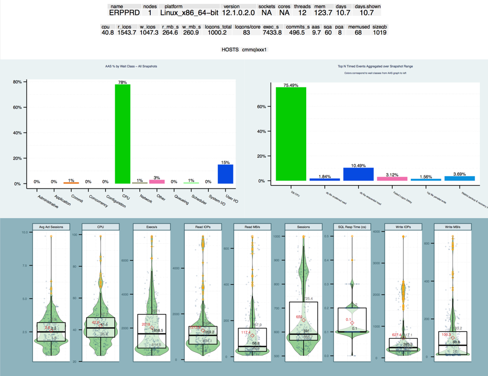
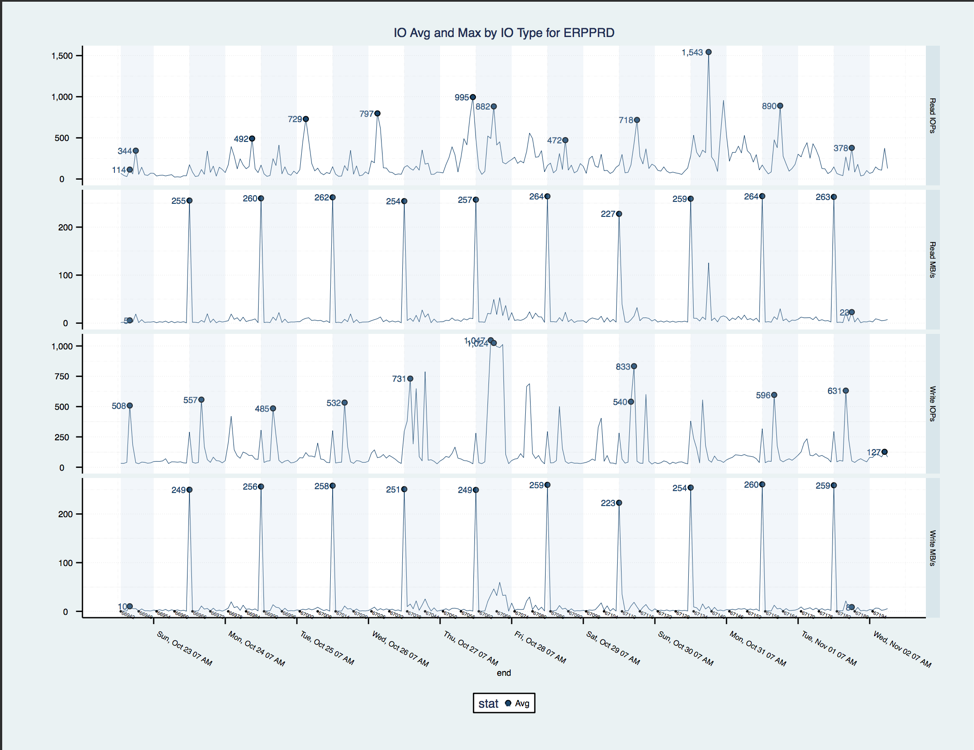
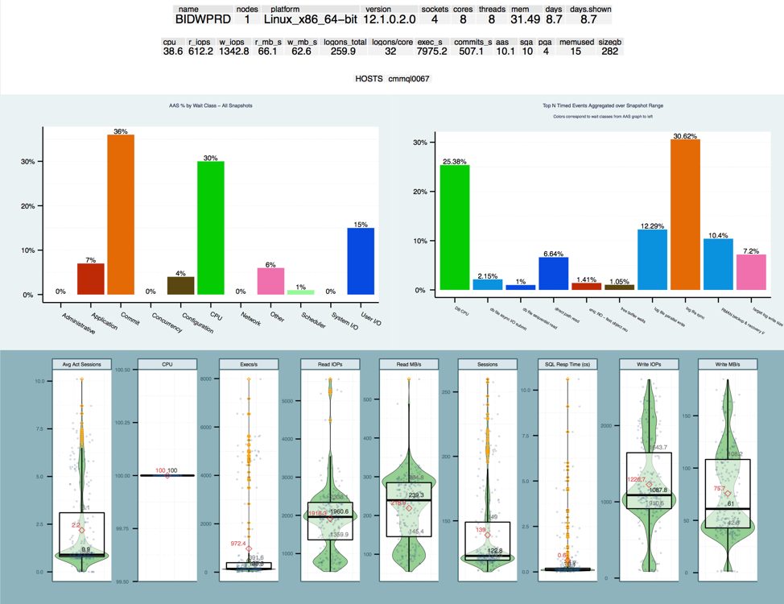
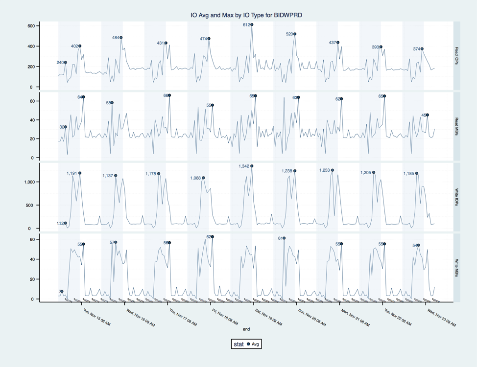
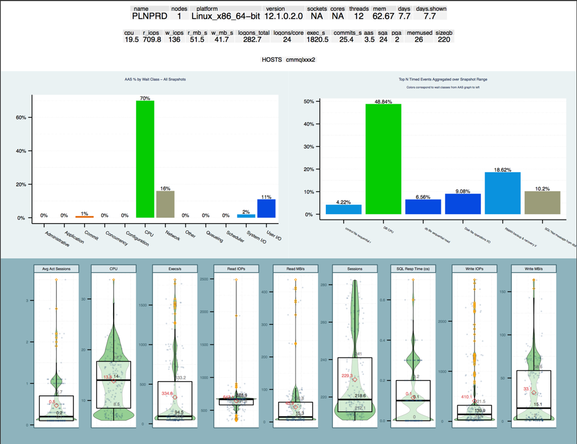
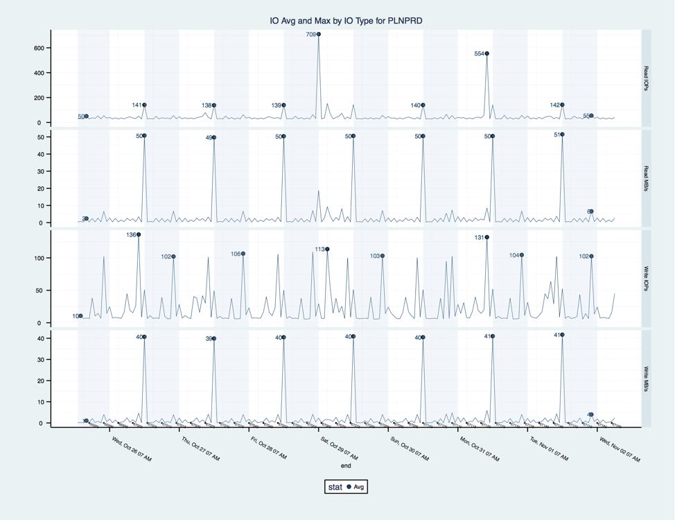
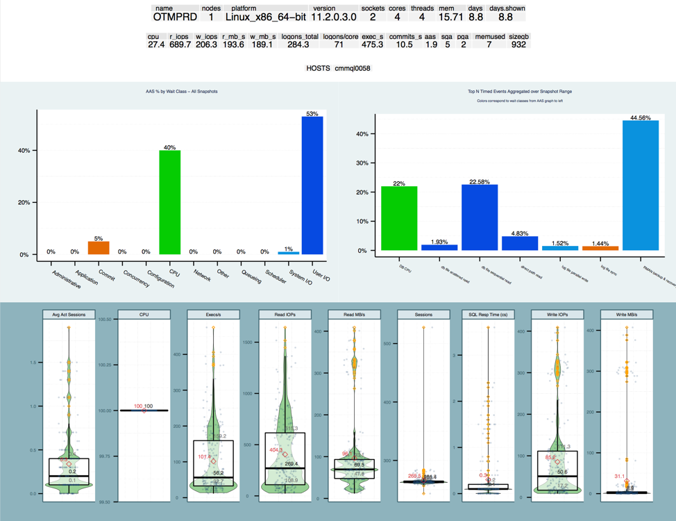
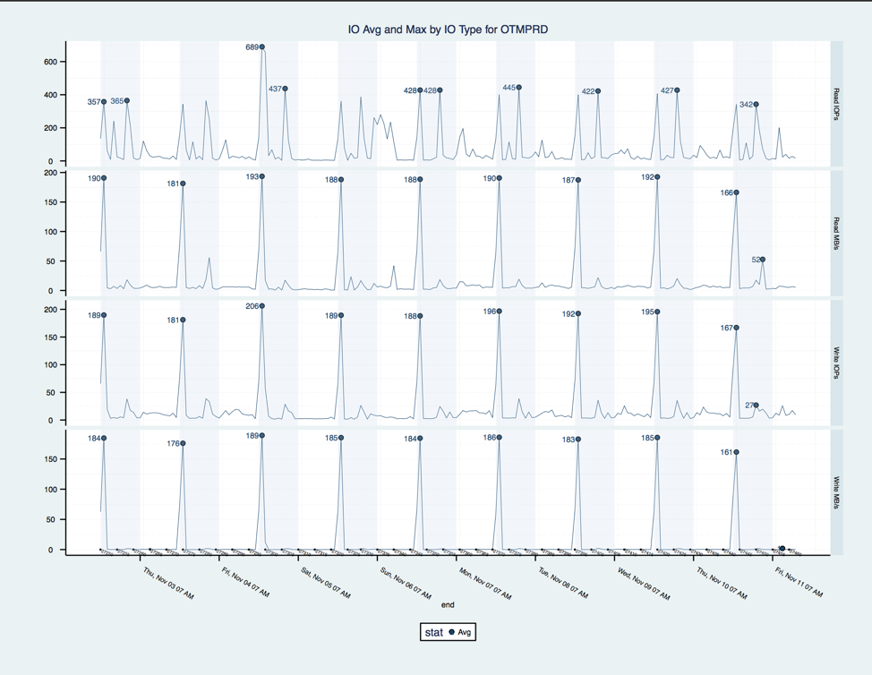

.. Adding labels to the beginning of your lab is helpful for linking to the lab from other pages
.. _designlab1:

----------------------------
Oracle on Nutanix Design Lab
----------------------------

Introduction
++++++++++++

**Basic Situation & Requirements -**

- Customer “City of Dreamland” is running Oracle databases for several packaged applications like EBS, OTM, etc.The current have four major databases “ERP” ,” BIDW”, “OTM”,”PLN”.

- Customer current using “HP ProLiant DL380 G7” for their ERP and PLN System using 1 socket with 12 cores(Intel Xeon Processor X5680” CPU) .”BIDW” using old server “IBM System x3755” with 4 socket total 8 core (Dual-Core Intel Xeon Processor 7040). “OTM” Server also using the old server “IBM System x3755” with 2 socket total 4 core (Dual-Core Intel Xeon Processor 7040)

- ERP database database is 2 TB , BIDW database size is 4TB, OTM database is 500GB , and PLN database is 1TB.

- The working set for the ERP, PLN, OTM system is 30% daily , BIDW system just 10 % of daily change.

- Customer do not familiar with virtualization technology , any kind of  hypervisor is acceptable.

- All the Oracle Server Edition is Enterprise Edition , and license is base on core license

- Customer is major concerned about Oracle licensing when virtualized and is under license pressure. Customer wants Nutanix to provide a quote and proposal to show how they can virtualize and minimize the license exposure to Oracle.

- Saving the cost will be the first priority target in this project

- Nutanix had already got the Oracle performance report “AWR” from customer, and parsed performance data (In the appendix “A”)

**HA Requirement –**

- Customer current use EMC CX4-120 storage and also implement EMC local protect solution SNAPVIEW

- ERP system also need increase RPO, they using EMC snapshot to protect their production database. They snapshot the database every 3 hrs. Due to EMC snapshot the maximum snapshot can keep 8 copies. Their target is increase the RPO within one hour

- Customer ERP production database is running on Physical Linux OS and protect the HA with Linux Native Cluster , and customer want increase the RTO from 10 minutes to 1 minutes. Other systems do not need so high RTO , at least 30 minutes for requirement.

**DR Requirement –**

- All this four Oracle database will need DR solutions , The RPO for PLN ,OTM, BIDW database is 1hrs. The ERP system because it’s most important , so RPO should be less than 15 minutes

- The Bandwidth is not limitation for customer , who have a dedicate and enough bandwidth network between two datacenter within 5 ms round-trip latency.

Requirements
++++++++++++

- Size only for Prod and provide a deployment architecture

- Provide the design that met customer RTO/RPO requirement

- Software licenses need be considered

- DR solution setup

Tools for sizing
++++++++++++++++

- CPU Benchmark
https://www.spec.org/cpu2006/

- SAP SD Standard Performance Tests
http://www.sap.com/solution/benchmark/measuring.html

- Nutanix Sizer
https://services.nutanix.com/#/

- Mindtickle Oracle Training (Nutanix Employee Only)

Appendix (Server information)
++++++++

**- ERP Server**

**- BIDW Server**

**- PLN Server**

**- OTM Server**

Lab Time
++++++++
Group discussion (30 minutes)
Review Desing (15 minutes)
